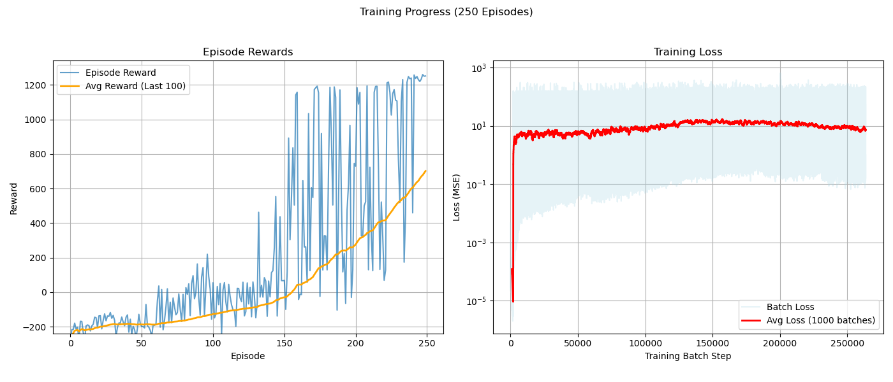

# 2D Self-Driving Car Simulation with Deep Reinforcement Learning

AI learns to drive! A 2D simulation where a Dueling Double DQN agent (PyTorch) navigates a complex track with obstacles, visualized using Pygame. This repository contains the code and results from training the agent for **250 episodes**.

## Self-Driving Car Simulation Video

[Watch Demo Video on YouTube](https://youtu.be/ruAR4OzTGuU)

---


## Features

*   **2D Simulation Environment:** Custom track layout with inner/outer boundaries and static obstacles using Pygame.
*   **Car Physics:** Simplified 2D car model with acceleration, braking, friction, and steering.
*   **Sensor Model:** Lidar-like ray casting sensors provide distance readings to walls/obstacles.
*   **Reinforcement Learning Agent:**
    *   Algorithm: Dueling Double Deep Q-Network (Dueling Double DQN).
    *   Framework: PyTorch.
    *   Input: Sensor readings and current car speed.
    *   Output: Discrete actions (Accelerate, Brake/Coast, Steer Left, Steer Right).
*   **Reward System:** Designed to encourage:
    *   Staying on the track and avoiding obstacles.
    *   Passing checkpoints sequentially.
    *   Completing laps.
    *   Maintaining forward speed.
    *   Driving efficiently (time penalty).
    *   Avoiding close proximity to walls/obstacles (proximity penalty).
*   **Training:** Includes code for training the agent, saving models periodically, and plotting learning progress (rewards and loss). GPU acceleration (CUDA) is supported if available.
*   **Evaluation:** Allows loading trained models and visualizing their performance step-by-step in the Pygame window.

## Training Progress (First 250 Episodes)

The agent shows significant learning within 250 episodes, successfully navigating the track and achieving high rewards, including lap completions.



*(Graph shows Episode Rewards (Individual and 100-ep Average) and Training Loss (Batch and Average) over 250 episodes)*

## Requirements

*   Python 3.8+
*   See `requirements.txt` for specific libraries.

## Installation

1.  **Clone the repository:**
    ```bash
    git clone https://github.com/proutkarsh3104/-2D-Self-Driving-Car-.git
    ```

2.  **Create a Virtual Environment (Recommended):**
    ```bash
    python -m venv venv
    # Activate the environment
    # Windows:
    .\venv\Scripts\activate
    # macOS/Linux:
    source venv/bin/activate
    ```

3.  **Install Dependencies:**
    Install the required packages using the provided `requirements.txt` file:
    ```bash
    pip install -r requirements.txt
    ```
    *   **Note on PyTorch:** The `requirements.txt` file lists `torch`. For optimal performance (especially GPU acceleration), visit the [official PyTorch website](https://pytorch.org/) and follow their instructions to install the specific version matching your OS and CUDA setup (if applicable). The command provided there might look different from the basic `pip install torch`.

## Usage

The project is structured as a Jupyter Notebook (`self_driving_car.ipynb`). Run the cells sequentially after installing the requirements.

**1. Training (Cells 1-5):**

*   Execute cells 1 through 5 in the `self_driving_car.ipynb` notebook.
*   **Configuration:** Key parameters can be adjusted in Cell 1. Note that the provided results (`dqn_car_episode_250.pth` and the graph) were generated with `NUM_EPISODES = 1000` but training was stopped or the results captured after 250 episodes. You can change `NUM_EPISODES` to train for longer. `RENDER_EVERY_N_EPISODES` is set to `0` for faster training without visualization.
*   **Output:**
    *   Trained models (`.pth` files) will be saved in the `Models/` directory (by default, the code saves to `dqn_car_models_complex_duel/`, you may need to adjust `MODEL_SAVE_DIR` in Cell 1 to match `Models/` or manually move the files).
    *   Training progress plots (`.png` files) will be saved in the `Training_progress/` directory (adjust `PLOT_SAVE_DIR` in Cell 1 to match or move files).

**2. Evaluation (Cell 6):**

*   This cell allows you to load saved models and watch the agent perform *with* visualization.
*   Ensure the code in Cells 1-4 matches the settings used when the model was trained.
*   **Running:** Execute Cell 6.
*   **Loading the Included Model:** To evaluate the provided `dqn_car_episode_250.pth` model, modify the `model_to_evaluate_single` path in Cell 6:
    ```python
    # In Cell 6, find the 'Run Evaluation' section
    MODEL_SAVE_DIR_EVAL = "Models" # Define the correct directory for evaluation
    model_to_evaluate_single = os.path.join(MODEL_SAVE_DIR_EVAL, "dqn_car_episode_250.pth")

    if os.path.exists(model_to_evaluate_single):
        evaluate_agent(model_to_evaluate_single, num_episodes=3) # Run 3 episodes
    else:
        print(f"Single model file not found: {model_to_evaluate_single}")
    ```
*   You can also use the `evaluate_model_range` function if you train for longer and save more models.

## Project Structure
```
├── Models/                     # Directory for saved model weights (.pth)
│   └── dqn_car_episode_250.pth    # Included model (trained 250 episodes)
├── Training_progress/         # Directory for saved training plots (.png)
│   └── training_progress_ep250.png # Included plot
├── self_driving_car.ipynb     # Main Jupyter Notebook with all code cells
├── requirements.txt           # Python dependencies
└── README.md                  # This file
```


## Future Improvements

*   Continue training beyond 250 episodes to potentially achieve higher and more stable performance.
*   Implement Prioritized Experience Replay (PER).
*   Experiment with other DRL algorithms (A2C, PPO, SAC).
*   Develop more complex tracks or procedural track generation.
*   Add dynamic obstacles.
*   Implement continuous action spaces for smoother steering/acceleration.
*   More sophisticated reward shaping.
*   Hyperparameter optimization using tools like Optuna.
